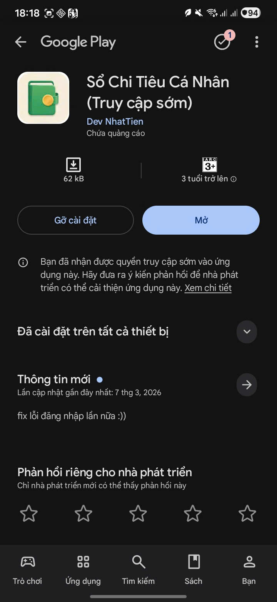

# 💰 Expense Manager
Hệ thống **quản lý tài chính cá nhân đa nền tảng** gồm:
* 📱 **Android App** — Kotlin + XML
* 🌐 **Web Dashboard** — Next.js + TypeScript
* ☁️ **Cloud Sync** — Firebase Auth + Cloud Firestore
Ứng dụng giúp người dùng theo dõi **chi tiêu, thu nhập, ví tiền, tiết kiệm, nợ và khoản vay**.
Ngoài ra còn tích hợp **AI trợ lý tài chính** hỗ trợ tạo giao dịch từ **ngôn ngữ tự nhiên**.
---
# 🚀 Tính năng chính
## 📱 Android
* Quản lý giao dịch: **thu, chi, chuyển tiền**
* Quản lý **ví và danh mục**
* Thống kê chi tiêu **theo ngày / tháng**
* Quản lý **nợ cá nhân và khoản vay**
* **Giao dịch định kỳ** và cảnh báo ngân sách
* **Android Widget** xem nhanh số dư
* **Khóa ứng dụng bằng sinh trắc học**
---
## 🌐 Web Dashboard
* Đăng nhập Google (**Firebase Auth**)
* CRUD **giao dịch, ví và danh mục**
* **Tìm kiếm và lọc** lịch sử giao dịch
* **Biểu đồ thống kê** chi tiêu
---
# 🏗 Kiến trúc hệ thống
Android sử dụng kiến trúc:
**MVVM + Repository + Room Database**
Đặc điểm:
* ☁️ Đồng bộ dữ liệu với **Cloud Firestore**
* 📡 Hỗ trợ **offline-first** (lưu cục bộ trước khi đồng bộ cloud)
---
# 🧰 Công nghệ sử dụng
### 📱 Android
* Kotlin
* Room Database
* WorkManager
* Firebase Auth / Firestore / AI
* MPAndroidChart
### 🌐 Web
* Next.js
* React
* TypeScript
* TailwindCSS
---
# 📸 Screenshots

## Android App

| Dashboard | Budget |
|-----------|-------|
|  |  |

| Features | AI Assistant |
|----------|-------------|
|  |  |

| Play Store |
|-----------|
|  |

---

## Web Dashboard

| Overview | Transactions |
|----------|-------------|
|  |  | giao diện**
* 🧩 **Mô tả kiến trúc hệ thống**
Source code sẽ được **chia sẻ khi phỏng vấn kỹ thuật**.
