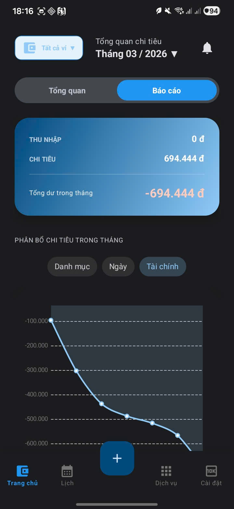
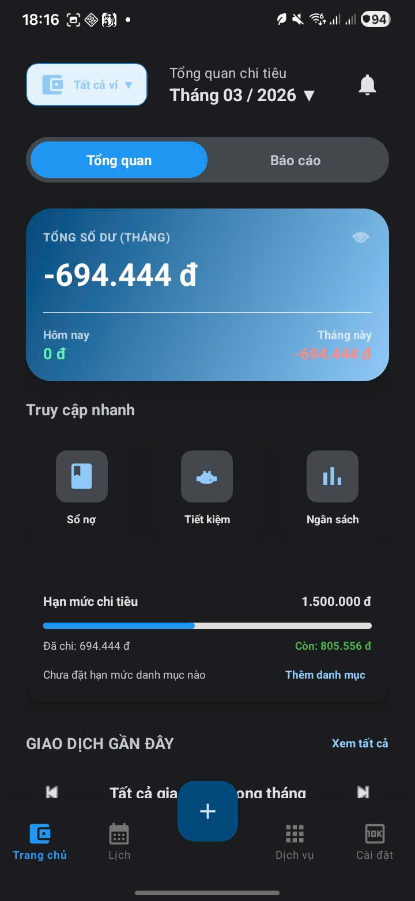
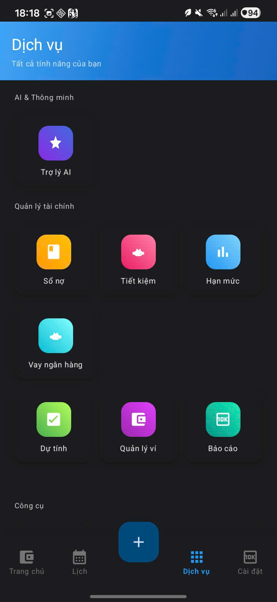
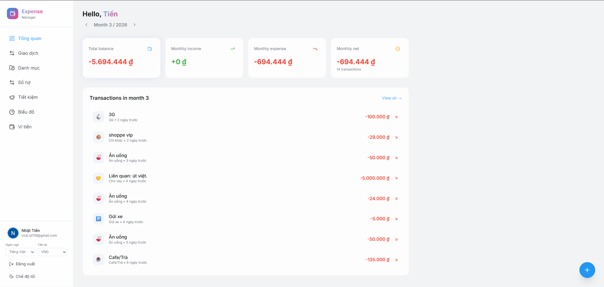
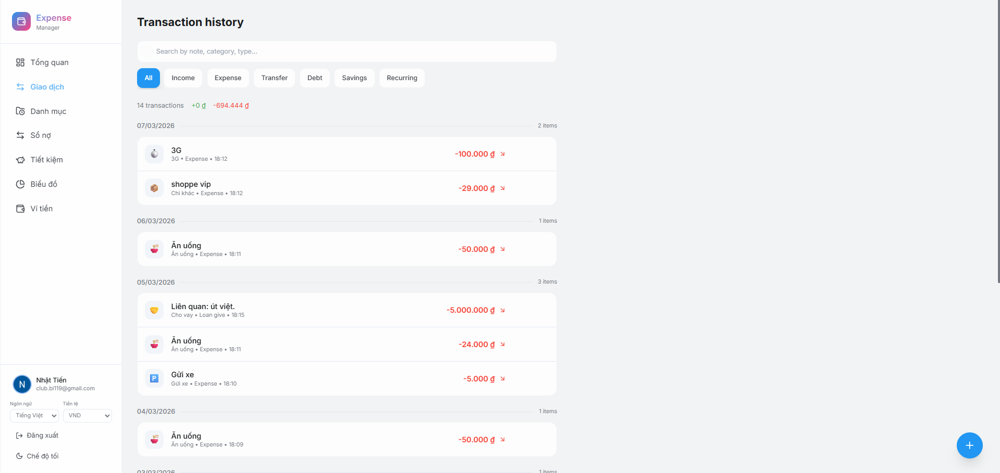

# 💰 Expense Manager

Hệ thống **quản lý tài chính cá nhân đa nền tảng** gồm:

* 📱 **Ứng dụng Android** — Kotlin + XML
* 🌐 **Web Dashboard** — Next.js + TypeScript
* ☁️ **Đồng bộ dữ liệu** — Firebase Auth + Cloud Firestore

Ứng dụng giúp người dùng theo dõi **thu nhập, chi tiêu, ví tiền, tiết kiệm, nợ và các khoản vay**.
Ngoài ra còn tích hợp **AI trợ lý tài chính** hỗ trợ tạo giao dịch bằng **ngôn ngữ tự nhiên**.

---

# 📸 Hình ảnh giao diện

## 📱 Ứng dụng Android

| Dashboard                           | Tổng quan ngân sách                 |
| ----------------------------------- | ----------------------------------- |
|  |  |

| Danh sách chức năng               | Trợ lý AI                        |
| --------------------------------- | -------------------------------- |
|  |  |

---

## 🌐 Web Dashboard

| Tổng quan                         | Lịch sử giao dịch                    |
| --------------------------------- | ------------------------------------ |
|  |  |

---

# 🚀 Tính năng chính

## 📱 Android

* Quản lý giao dịch: **thu, chi, chuyển tiền**
* Quản lý **ví và danh mục**
* Thống kê chi tiêu **theo ngày / tháng**
* Quản lý **nợ cá nhân và khoản vay**
* **Giao dịch định kỳ** và cảnh báo ngân sách
* **Widget Android** hiển thị nhanh tình trạng tài chính
* **Khóa ứng dụng bằng sinh trắc học**

## 🌐 Web Dashboard

* Đăng nhập Google (**Firebase Auth**)
* CRUD **giao dịch, danh mục và ví**
* **Tìm kiếm và lọc** lịch sử giao dịch
* **Biểu đồ thống kê** chi tiêu theo tháng

---

# 🏗 Kiến trúc hệ thống

Ứng dụng Android sử dụng kiến trúc:

**MVVM + Repository + Room Database**

Đặc điểm:

* ☁️ **Đồng bộ dữ liệu với Firebase Firestore**
* 📡 **Offline-first** (lưu dữ liệu cục bộ trước khi đồng bộ lên cloud)

---

# 🧰 Công nghệ sử dụng

## 📱 Android

* Kotlin
* Room Database
* WorkManager
* Firebase Auth / Firestore / AI
* MPAndroidChart

## 🌐 Web

* Next.js
* React
* TypeScript
* TailwindCSS

---

# 🎥 Demo

Repository này chỉ cung cấp **ảnh giao diện và mô tả hệ thống**.

Source code **không được công khai** và sẽ được **chia sẻ khi phỏng vấn kỹ thuật nếu cần**.
