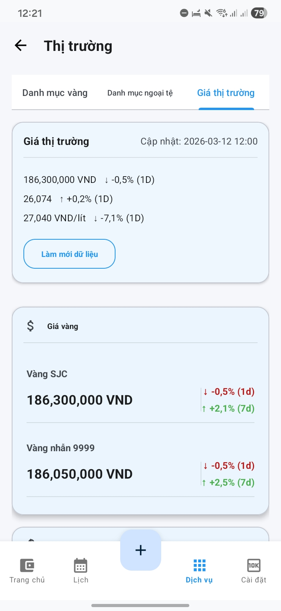
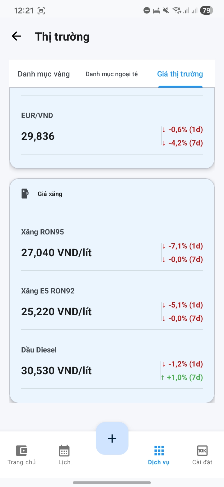

# 💰 Expense Manager

**Expense Manager** là hệ thống **quản lý tài chính cá nhân đa nền tảng** giúp người dùng theo dõi thu nhập, chi tiêu, tiết kiệm, công nợ và danh mục tài sản.

Hệ thống gồm hai thành phần chính:

* 📱 **Android App** — ứng dụng chính để nhập và quản lý dữ liệu tài chính
* 🌐 **Web Dashboard** — xem báo cáo và quản lý dữ liệu trên trình duyệt

Dữ liệu được **đồng bộ theo thời gian thực** thông qua **Firebase Authentication và Cloud Firestore**.

---

# 📸 Screenshots

## 📱 Android App

### Dashboard & Budget

| Dashboard                           | Budget Overview                     |
| ----------------------------------- | ----------------------------------- |
|  |  |

---

### Features & AI Assistant

| Feature Menu                      | AI Assistant                     |
| --------------------------------- | -------------------------------- |
|  |  |

---

### Market Monitoring

| Market Overview                     | Gold Prices                     |
| ----------------------------------- | ------------------------------- |
|  |  |

---

## 🌐 Web Dashboard

| Dashboard                         | Transactions                         |
| --------------------------------- | ------------------------------------ |
|  |  |

---

# 🚀 Core Features

## 📱 Android Application

* Quản lý giao dịch **thu nhập, chi tiêu và chuyển tiền**
* Quản lý **ví tiền và danh mục chi tiêu**
* Thống kê tài chính **theo ngày / tháng**
* Quản lý **công nợ cá nhân**
* Quản lý **khoản vay ngân hàng**
* **Giao dịch định kỳ (Recurring Transactions)**
* **Cảnh báo ngân sách**
* **Widget Android** hiển thị nhanh tình trạng tài chính
* **Khóa ứng dụng bằng sinh trắc học**
* **AI trợ lý tài chính** hỗ trợ tạo giao dịch bằng ngôn ngữ tự nhiên

---

# 💰 Savings System

Ứng dụng hỗ trợ quản lý tiết kiệm theo hai lớp:

* **Savings transactions** (gửi / rút tiền tiết kiệm)
* **Savings books** với lãi suất và kỳ hạn

Cho phép:

* theo dõi lịch sử tiết kiệm
* quản lý nhiều sổ tiết kiệm
* nhóm mục tiêu tiết kiệm theo bucket

---

# 💳 Debt & Loan Tracking

Ứng dụng hỗ trợ quản lý:

* **công nợ cá nhân**
* **khoản vay ngân hàng**

Tính năng:

* theo dõi số tiền đã trả
* nhắc ngày đến hạn
* tự động tạo giao dịch thanh toán khoản vay

---

# 📊 Market Monitoring

Ứng dụng tích hợp dữ liệu thị trường để hỗ trợ quản lý tài sản.

Theo dõi:

* giá **vàng**
* tỷ giá **ngoại tệ**
* giá **xăng dầu**

Dữ liệu được tổng hợp từ nhiều nguồn và lưu lịch sử để phân tích xu hướng.

---

# 🌐 Web Dashboard

Web dashboard cho phép:

* đăng nhập Google (**Firebase Authentication**)
* CRUD **giao dịch, ví và danh mục**
* **tìm kiếm và lọc giao dịch**
* **biểu đồ thống kê chi tiêu**
* quản lý dữ liệu tài chính từ trình duyệt

---

# 🏗 System Architecture

Hệ thống được thiết kế theo mô hình **multi-platform architecture**.

Android hoạt động theo mô hình **offline-first**, trong khi web dashboard hoạt động theo **cloud-first**.

### Data Flow

```
Android UI
   ↓
ViewModel
   ↓
Repository
   ↓
Room Database (Local Storage)
   ↓
Firebase Firestore (Cloud Sync)
   ↑
Web Dashboard
```

### Android Architecture

Android sử dụng kiến trúc:

```
MVVM + Repository + Room Database
```

Các thành phần chính:

* ViewModel
* Repository
* Room Database
* Firebase Firestore sync
* WorkManager background jobs

---

# 🔄 Data Synchronization

Dữ liệu được lưu theo cấu trúc:

```
users/{uid}/transactions
users/{uid}/wallets
users/{uid}/categories
users/{uid}/savings_books
users/{uid}/market_history
users/{uid}/market_gold_assets
users/{uid}/market_currency_assets
```

Điều này cho phép:

* Android và Web **chia sẻ cùng dữ liệu**
* đồng bộ **real-time**
* sử dụng **multi-device**

---

# 🤖 AI Financial Assistant

Ứng dụng tích hợp **AI trợ lý tài chính** sử dụng **Firebase AI / Gemini**.

AI có thể:

* phân tích dữ liệu tài chính hiện tại
* trả lời câu hỏi về chi tiêu
* tạo giao dịch từ **ngôn ngữ tự nhiên**

Ví dụ:

```
"Tôi ăn phở 50k sáng nay"
```

AI sẽ tự động tạo một **transaction chi tiêu** trong hệ thống.

---

# 🧩 Sample Code

Ví dụ một đoạn code Kotlin trong module **Market Data** sử dụng **Kotlin Coroutines** để tải dữ liệu thị trường (vàng, ngoại tệ, xăng) song song.

```kotlin
// Fetch market data concurrently (gold, currency, fuel)
suspend fun loadMarketSnapshot(): MarketSnapshot = coroutineScope {

    // Load gold prices from aggregator
    val goldDeferred = async {
        runCatching { goldAggregator.loadGoldPrices() }
    }

    // Load currency exchange rates
    val currencyDeferred = async {
        runCatching { fetchCurrencySnapshot() }
    }

    // Load fuel prices
    val fuelDeferred = async {
        runCatching { fuelDataSource.loadFuelSnapshot() }
    }

    // Await results from parallel API calls
    val goldResult = goldDeferred.await()
    val currencyResult = currencyDeferred.await()
    val fuelResult = fuelDeferred.await()

    // Combine results into a single market snapshot
    MarketSnapshot(
        goldPrices = goldResult.getOrDefault(emptyList()),
        currencyRates = currencyResult.getOrNull(),
        fuelPrices = fuelResult.getOrNull(),
        fetchedAt = System.currentTimeMillis()
    )
}
```

Đoạn code trên thể hiện:

* **Kotlin Coroutines (`async / await`)**
* gọi nhiều API song song để giảm thời gian chờ
* xử lý lỗi an toàn bằng `runCatching`
* tổng hợp dữ liệu thị trường thành một snapshot

---

# ⚙️ Technologies

## Android

* Kotlin
* MVVM Architecture
* Room Database
* WorkManager
* Firebase Authentication
* Cloud Firestore
* Firebase AI (Gemini)
* MPAndroidChart

## Web

* Next.js
* React
* TypeScript
* TailwindCSS
* Firebase SDK

---

# 🔐 Security

* Firebase Authentication (Google Sign-In)
* Firebase App Check
* Biometric lock trên Android
* Firestore security rules theo `userId`

---

# 🎬 Demo

Web Dashboard:

[https://expense-manager-web--expensemanager-69017.us-east4.hosted.app/](https://expense-manager-web--expensemanager-69017.us-east4.hosted.app/)

Repository này chỉ cung cấp:

* hình ảnh giao diện
* mô tả kiến trúc hệ thống

Source code **không được công khai** và sẽ được chia sẻ trong **technical interview nếu cần**.

---

# 👨‍💻 Author

**Trịnh Nhật Tiến**
Android Developer (Fresher)

GitHub:

[https://github.com/Nhattien2912](https://github.com/Nhattien2912)
